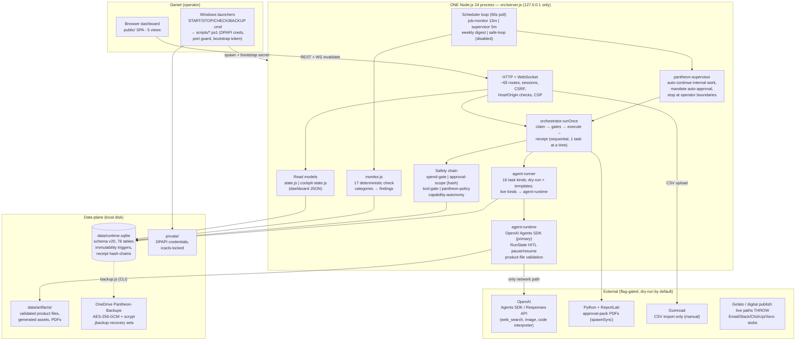
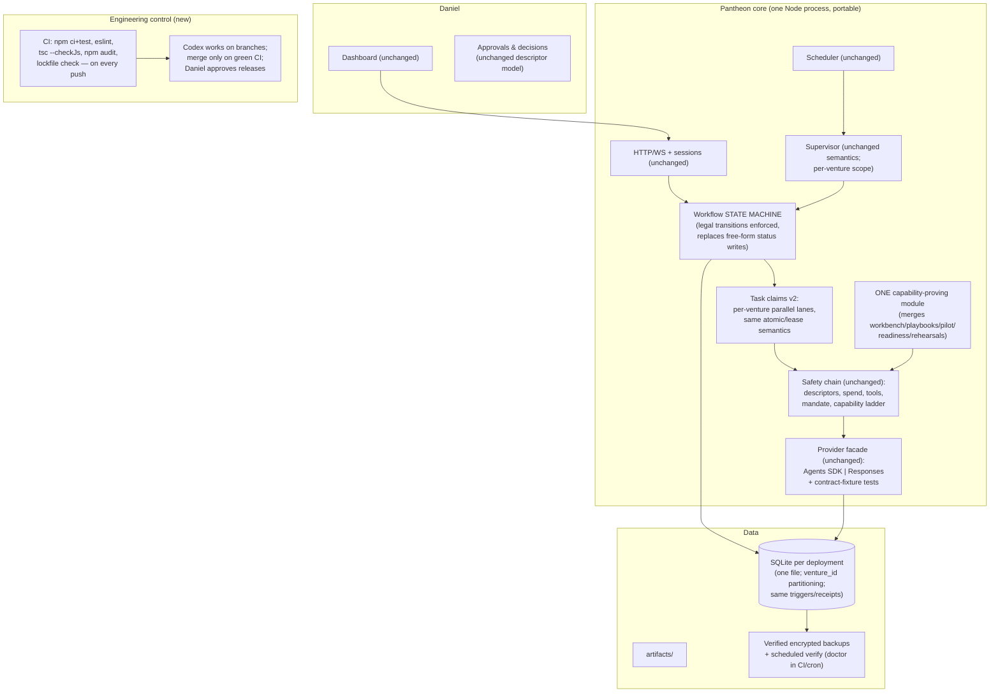

# Pantheon — Comprehensive Repository and System Audit

**Date:** 2026-07-21
**Auditor:** Claude (principal-architect / AI-systems / security / DevOps / product review)
**Repository:** `C:\Jarvis-Codex-AI-Business` — audited at worktree `pantheon-system-audit-6d853c`, commit `0b9f3ca` ("Build Pantheon commercial operating foundation", 2026-07-18), branch tip identical to `main`.
**Mode:** Analysis only. No repository file was created, modified, or deleted. All runtime checks used an isolated scratchpad data directory. No live model calls, no external side effects, no secrets read or printed.

---

## 1. Executive verdict

**What Pantheon is currently (High confidence).**
Pantheon today is **not** an autonomous multi-agent business system. It is a **well-engineered local governance and control plane for AI-assisted business work**: a single Node.js process with a SQLite ledger (76 tables), an authenticated localhost dashboard, a scheduler, a monitor, and an unusually rigorous approval/spend/audit machine wrapped around a *very narrow* live-AI aperture. Real model calls happen only for two task kinds (live worker execution and live research), only after a hash-bound, single-use, worst-case-priced approval, and only within an A$100/month mandate. Everything else the "11-worker AI team" produces in normal operation is **deterministic template text, honestly labelled as such** (`src/runtime/agent-runner.js:338-627`).

That description is not a criticism. It matches what the project's own documents claim — the Master Plan, Build Log and release proof are conspicuously honest ("It is not yet a proven autonomous business", `docs/proofs/2026-07-18-pantheon-release-proof.md`) — and it is the correct shape for the current stage. But the owner should hold both facts at once: the *plumbing* for supervised AI operations is real and good; the *autonomous multi-venture business machine* described in the long-term vision does not exist yet, and several of its prerequisites (parallel ventures, parallel task execution, publishing, selling) are currently welded shut on purpose.

**What is real and functional (High confidence — verified by reading the code, running the 201-test suite, and booting the server).**
- Durable task queue with atomic claims, leases, crash recovery, and a genuinely fail-closed rule that anything which *may* have reached the AI provider is never auto-retried (`src/runtime/task-claims.js`, `src/runtime/orchestrator.js`).
- Approval system with canonical-JSON SHA-256 "execution descriptors" binding each paid action to exact provider, model, input hash, tools, limits, trace policy and worst-case cost; approvals are single-use, expiring, and invalidated by any scope drift (`src/runtime/approval-scope.js`).
- A real OpenAI Agents SDK integration with human-in-the-loop resume via serialized, hash-verified run state; provider dispatch recorded *before* the network call; approved-tool activity reconciled against observed provider activity (`src/runtime/agent-runtime.js`).
- Money truth: integer-cent AUD ledgers, reserved/estimated/unknown/reconciled cost states, immutable reconciled accounting entries (SQLite triggers), monthly-mandate budget gate.
- Local security that passed live probing during this audit: loopback-only bind, launcher bootstrap secret, HMAC sessions, CSRF, Host/Origin checks (all returned the correct 401/403s).
- Encrypted (AES-256-GCM + scrypt) verified backups, retention policy ledger, factory-reset guard.
- A 201-case deterministic offline test suite that passes cleanly (76 s) and tests behaviour, including security, recovery and money-safety scenarios.

**What is incomplete.** The commercial pipeline past "validated opportunity": Product Builder's paid production run, quality review of real files, publishing, selling, and results measurement have machinery but no proven runs. The Gumroad path is import-only. The four-call Luna proof demonstrated the operating path, not commercial output.

**What is only conceptual.** Multiple parallel ventures (the schema *enforces* exactly one active venture — `src/db.js:1071-1073`); parallel task execution (the claim query enforces one task at a time per workflow, and the orchestrator is a sequential loop); publishing/fulfilment (both publish adapters **throw** on live mode); email/Slack/ClickUp/Xero integrations (status stubs); dynamic agents; cloud or remote operation; a legal/accounting *function* beyond ledgers and hard-stops.

**Is the direction technically credible?** Yes (High confidence). The build order — state, approvals, money, recovery, tests first; autonomy last, earned per-capability after five reviewed successes — is the correct order, and it is the opposite of the failure mode that kills most "AI business OS" projects (prompt-first theatre). The prior generations were archived rather than half-kept, and decisions are recorded.

**Can this architecture evolve into the intended system?** Mostly (Medium confidence). The control plane, evidence model and approval model will carry forward essentially unchanged. Two things will *not* stretch to the stated end-state without deliberate rework: the single-active-venture / sequential-execution model, and the single-process, single-machine, Windows-only runtime. Neither needs fixing now; both need a planned re-architecture gate before "multiple ventures in parallel" is attempted.

**Is a major redesign needed? No.** Is it overengineered? **In one specific way, yes:** roughly five overlapping capability-proof frameworks (workbench, playbooks, pilot fixtures, model-readiness packs, rehearsal suites — ~150 KB of code) exist to promote what is currently two capabilities of one worker; and several read-model/UI files are god-modules. Is it underengineered in critical areas? **Also yes:** there is no CI, no linter, no type checking, no devDependencies at all, and the development process depends on one AI maintainer (Codex) voluntarily running `npm test`. And on this machine, **the encrypted recovery set currently fails verification** (doctor FAIL) — the disaster-recovery story is broken *right now* while everything else is polished.

**The three most important conclusions:**

1. **The foundation is real, safe and honest — protect it.** The approval/spend/receipt machinery is stronger than most production systems of this size. The single most valuable property of this codebase is that it *refuses to fake autonomy*; every claim in the docs traced to working code or an explicit gate. (High confidence)
2. **The bottleneck to the vision is not orchestration plumbing — it is the commercial loop.** Nothing in this repo has yet designed, built, published or sold anything. Most "agent work" is templates; the one real AI path is validated. The correct next investment is exactly what the roadmap says: run the discovery→validation→build→publish→sell loop once, with Daniel doing the external steps — not more framework. (High confidence)
3. **Maintenance economics and recovery are the live risks.** ~34,000 lines of hand-rolled runtime, one maintainer, no CI/lint/types, Windows-only operations, documentation already drifting three days after release (stale ADR 0006, `config/*.md` that no code reads), and a currently-failing backup verification. Fix the recovery set immediately; add CI and a linter this week; schedule doc reconciliation. (High confidence)

---

## 2. System purpose reconstructed from the repository

**Intended system (from `docs/Pantheon Master Plan.md`, `AGENTS.md`, `docs/plans/*`, ADRs 0001–0006):**
A local, desktop-first "AI business operating system" in which a fixed, supervised team of 11 specialist AI workers (Chief of Staff; Opportunity Scout + Demand Validator; Offer Architect, Product Builder, Copy & Conversion, Distribution; Customer Voice, Finance, Growth Analyst, Quality Reviewer) investigates, builds, launches, measures and improves online ventures, while Daniel remains final decision-maker for every consequential action. First proof is deliberately narrow: one digital-product venture, Gumroad Direct checkout, faceless brand, three independent paying buyers, positive AUD cash contribution, ≤8 operator hours/week. Model routing is per-assignment across three cost tiers (Luna/Terra/Sol). Internal analysis and approved research run within an A$100/month mandate; publishing, customer contact, accounts, KYC, paid ads, money movement, legal/tax are protected actions or hard stops. Autonomy is promoted per exact capability after five consecutive operator-reviewed successes. The OpenAI Agents SDK is the first-class worker runner inside Pantheon's boundaries; the Responses API is a lower-level fallback path. Jarvis (Codex) is the *developer/steward outside the runtime*, not a runtime worker.

**Match between intent and implementation (High confidence):** unusually close. The 11-worker roster, mandate auto-approval, capability ladder, protected actions, cost states, receipts, retention plan, monitor and recovery flows all exist in code and are tested. The release proof's claims (schema 20, 201 tests, four-call Luna proof, A$1.18 July exposure) were reproduced or corroborated during this audit.

**Documented inconsistencies found:**
| # | Inconsistency | Evidence |
|---|---|---|
| 1 | ADR 0006 still says the Luna/Terra/Sol router is "not yet implemented"; Master Plan and Build Log say implemented (it is — `src/runtime/model-routing.js`, tested) | `docs/decisions/0006-…md` vs `docs/Pantheon Master Plan.md:184-189` |
| 2 | `config/guardrails.md` claims to "define what Pantheon may do without asking first", but **no `src/` code reads any `config/*.md`**; real enforcement is `pantheon-policy.js` + approvals. The files also encode the obsolete Claude-era model (Stage-1/Stage-2 autonomy, "Designers", POD/Etsy) | grep of `src/` for the filenames: zero hits |
| 3 | Two coexisting autonomy vocabularies: global "Stage 1 proving mode" (`config/guardrails.md`, `CONFIG.autonomyStage`) vs per-capability 5-pass streaks (ADR 0005/0006, `capability_autonomy` table) | `src/config.js:99` still ships `autonomyStage` |
| 4 | Retention schedule "active" (Master Plan) vs "immutable proposal pending approval" (Phase-1 plan, operating procedures) — code supports both states; docs disagree about which is current | `docs/Pantheon Master Plan.md:200-206` vs `docs/plans/AUTONOMOUS-AGENT-OPERATIONS…` |
| 5 | `archive/historical/README.md` points to `docs/Jarvis-Codex Master Plan.md` / Build Log — filenames that no longer exist after the 07-18 rename | archive README "current source of truth" list |
| 6 | The 07-14 plan's first-live-run constraints ("no tools, no handoffs, one turn") were superseded by the actual proof (web search + handoffs); both plans remain in `docs/plans/` with only a status line distinguishing them | `docs/plans/FOUNDATION-TO-FIRST-REVENUE…` Phase 5 |
| 7 | "Jarvis" means the runtime actor in `config/*.md` and `GUMROAD-LAUNCH-GATE.md`, but the Codex steward everywhere else; legacy `JARVIS_*` env vars, `jarvis.*` schema IDs and cookie names persist (deliberate compatibility, but a live confusion source) | `src/config.js:53-62`, `approval-scope.js:5` |

---

## 3. Repository coverage report

**Commands run (all safe, all against isolated scratchpad data where state was involved):**
- `node --version` → v24.14.0 (matches engines `>=24 <25`); `npm ci --no-audit --no-fund` → clean install (105 packages).
- `npm test` → **201/201 pass, 0 fail, 76.1 s, fully offline** (temp DB per suite; `OPENAI_API_KEY` and live flags scrubbed by `scripts/run-tests.js`).
- `node scripts/doctor.js` → **11 PASS / 1 FAIL** — FAIL: "Recovery set: Pantheon found recovery-set files, but none passed decryption, manifest, inventory, and database verification." (See finding P-01.)
- `npm audit` → **0 vulnerabilities**.
- `node scripts/seed-runtime.js` + `node scripts/run-dry-pipeline.js` → seeded clean; pipeline idle (fresh seed has no queued work — expected).
- Live server boot (`node src/server.js`, port 5099, scratchpad DB): health 200 with `operationsReady:true`, `externalActionsMode:"locked"`, `paidAiArmed:false`; startup monitor cycle ran; unauthenticated `/api/cockpit` → 401; session without bootstrap secret → 401; session with bootstrap → 201 and authenticated cockpit → 200; mutation without CSRF → 403; forged Host header → 403; clean shutdown.
- `git log/branch` review: 21 commits, 2026-07-16 → 07-18; branches `main`, two `archive/pre-foundation-*`, this audit branch.

**Areas inspected (full read unless noted):**
- Core: `src/config.js`, `src/db.js` (all 20 migrations, all table definitions), `src/server.js` (bootstrap/security/static + route table), `src/runtime/local-security.js`, `task-claims.js`, `orchestrator.js`, `agent-runner.js`, `agent-runtime.js`, `scheduler.js`, `pantheon-supervisor.js`, `approvals.js`, `approval-scope.js`, `spend-gate.js`, `pantheon-policy.js`, `capability-autonomy.js`, `agent-tool-gate.js` (first ~300 lines + validation paths), `planner.js`, `agent-context.js` (~40%), `ai-team.js` (definitions + contract machinery), `live-ai-workers.js` (head + constants), `model-pricing.js` (head), `cost-ledger.js` (API surface), `monitor.js` (check-category survey).
- Docs: `README.md`, `AGENTS.md`, `docs/Pantheon Master Plan.md` (full), `docs/Pantheon Build Log.md` (position + decisions + key sections), all 6 ADRs, all 3 plans, release proof, both reviews, `config/*.md`, `.codex/config.toml`, `.env.example`, `.gitignore` — direct reads plus a dedicated documentation-reconstruction pass.
- Tests: full suite executed; per-file coverage themes catalogued from test names; safety-critical suites reviewed by name and cross-referenced with the modules they exercise.
- Ops: all root `.cmd` launchers, `scripts/*.ps1` and `scripts/*.js` (via dedicated ops inventory pass), `scripts/render-approval-pack.py` (role verified).
- Dashboard: `public/index.html` structure, `app.js` transport/panels (inventory pass; not line-by-line).

**Areas *not* deeply inspected (disclosed limitations):**
- `archive/historical/` (orientation only — 175+ files of prior generations; treated as reference, per its own README).
- `c:\ai-workspace` (confirmed: stale Generation-1 workspace; `docs/superpowers/plans|specs` are **empty**; zero references from the Pantheon repo — outside the audit boundary).
- Line-by-line reads of: `cockpit-state.js`, `state.js`, `agent-workbench.js`, `agent-playbooks.js`, `agent-model-readiness.js`, `agent-execution-evidence.js`, `pantheon-opportunities.js`, `pantheon-production.js`, `backup.js`, `retention-policy.js`, `research.js`/`live-ai-worker.js` adapter internals, `public/app.js` — these were covered by structural inventory, exports/call-graph analysis, and by the passing test suites that exercise them (e.g., backup/restore/retention have 15+ dedicated passing tests). Residual risk: a defect confined to an unread interior line of these files would not have been seen.
- The four-call live proof itself (provider-side traces) — not reproducible without spending money; corroborated via the local receipts design and docs.
- No penetration test, no load test, no long-duration soak test was performed.

---

## 4. Architecture map

### 4.1 Current architecture (as verified in code)

**Major components.** One process; no queues beyond SQLite tables; no microservices; no cloud. Control plane = scheduler + supervisor + orchestrator + gates. Data plane = SQLite + artifact files. Administrative plane = launchers, doctor, backup/restore CLIs (outside the server process). User-facing = the SPA (presentational only; all logic server-side).

**Principal control flow (task):** operator command or supervisor → `planner.createCommandPlan` (deterministic, fixed 4-task pipeline) or live-worker request builders → tasks queued → `orchestrator.runOnce`: atomic claim → spend gate → approval scope validation → budget reservation → consume approval → execute (template | research adapter | Agents SDK) → stage result → workflow projection → complete claim → finalize immutable receipt (`finally`).

**Agent communication flows.** Agents do not talk to each other freely. Three narrow channels exist: (1) SDK-internal handoffs inside one approved run (Scout → Validators, observed in the four-call proof); (2) `agent_handoffs` rows that pause for operator decision and, on approval, queue a Chief-of-Staff follow-up task; (3) Chief of Staff may prepare **exactly one** bounded specialist assignment (`chief-orchestration.js`), which itself requires a separate approval. There is no free-form agent-to-agent messaging — by design.

**Current sources of truth.** Architecture/intent: `docs/Pantheon Master Plan.md` (+ Build Log as memory). State: `data/runtime.sqlite` exclusively. Prompts/roles: `AI_TEAM_DEFINITIONS` in `src/runtime/ai-team.js` (mirrored into `agent_definitions` table). Config: env vars via `src/config.js` (**not** `config/*.md`, despite appearances). Workflow policy: code (`AGENT_POLICIES`, `pantheon-policy.js`), not prompts.

### 4.2 External dependencies

7 runtime deps (`@openai/agents 0.13.4`, `openai 6.47.0`, `zod`, `ws`, `adm-zip`, `csv-parse`, `lucide`), zero devDependencies, Node 24 built-ins for HTTP/SQLite/crypto/tests. Python+ReportLab is an **undocumented-in-README runtime dependency** for approval-pack PDFs (doctor checks it). OneDrive is the implicit off-site backup transport. Windows DPAPI + icacls are hard dependencies of credential storage.

---

## 5. Capability matrix

Status legend: Working / Partially working / Prototype / Placeholder / Documented only / Missing / Contradictory.

| Capability | Intended behaviour | Current implementation | Status | Evidence | Main gap | Recommended next step |
|---|---|---|---|---|---|---|
| Opportunity discovery | Scout ranks real opportunities from live web evidence | Approval-gated Agents SDK run with web_search; opportunity_rounds/opportunities tables; proof run stored 137 sources | **Working (gated)** | `pantheon-opportunities.js`, release proof | Only 1 proof run; quality unproven at scale | Run the first real broad scan (roadmap "Now") |
| Market research & validation | Demand Validator challenges candidates with sourced evidence | Live research adapter + SDK path; provenance persisted (`research_sources`, `agent_run_provenance`); supplied-evidence pilot fixtures | **Working (gated)** | `research.js`, `agent-execution-evidence.js`, tests | Live billing reconciliation manual | Continue; reconcile July spend |
| Strategic planning | Turn evidence into plans | `planner.js` fixed 4-task template pipeline; templates in `outputForTask` | **Placeholder (deterministic)** | `planner.js:99-106` ignores intent | No real planning intelligence | Acceptable for Phase 1; revisit only if it blocks a real venture |
| Product design & development | Product Builder creates real sellable files | Code Interpreter pipeline with manifest/format/zip-slip validation; image pipeline; **no paid production run yet** | **Prototype** | `agent-runtime.js:274-641`, `pantheon-production.js`, tests | Unproven with real spend | First paid Product Builder assignment (roadmap "Next") |
| Website/app development | (Long-term lifecycle item) | Nothing | **Missing** | — | Out of Phase-1 scope | Defer |
| Branding, marketing, content | Copy/Distribution agents produce channel tests | Template outputs + execution packs (manual market contact) | **Partially working** | `test-execution-pack.js`, templates | Content is templated until live runs | Use live workers for copy when venture selected |
| Sales & checkout | Gumroad Direct sells product | CSV import (idempotent, buyer-hash privacy) only; publish adapters throw on live | **Missing (by design)** | `gumroad-import.js`; `digital-products.js:27` | Daniel must create account/publish | Keep manual; prepare Publish Pack |
| Legal & compliance | Risk screening; hard stops | Prompt-level risk_screen template + hard stops in code (`PROTECTED_ACTIONS`) | **Placeholder + working stops** | `pantheon-policy.js:16-26` | No real legal capability (correct) | Keep human/professional review |
| Accounting & finance | AUD net-cash truth | Ledgers, immutable reconciled entries, mandate exposure, FX evidence rules, reconciliation batch API | **Working** | `accounting-ledger.js`, `cost-ledger.js`, migration 10/11, tests | Provider billing reconciliation is manual | Reconcile monthly, keep |
| Launch & publishing | Approval-gated publishing | Dry-run drafts + approval packs only; live throws | **Missing (deliberate)** | `adapters/gelato.js:27` | Entire external surface | Build Gumroad publish pack flow (manual publish) |
| Monitoring & analytics | Independent runtime monitoring | 17-category deterministic monitor, scheduler-backed, fingerprint-deduped findings; results ledger + scorecards | **Working** | `monitor.js`, `commercial-results.js` | No provider-cost telemetry beyond estimates | Keep |
| Ongoing optimisation | Learning cycles improve next actions | Deterministic learning-cycle records + revision plans | **Partially working** | `research-to-experiment.js`, tests | Learning content is human/AI-supplied, loop unproven | Exercise via first venture |
| Human approval | Everything consequential pauses | Descriptor-hashed approvals, tool interruptions, decision inbox, PDF packs, action tokens | **Working (strong)** | `approval-scope.js`, boot probes | — | Keep |
| Multi-venture parallel operation | Up to 3 concurrent ventures post-proof | Schema **enforces one active venture**; sequential task execution | **Missing (schema-blocked)** | `db.js:1071-1073`; `task-claims.js:152-162` | Deliberate; needs planned rework | Design gate before venture #2 |
| Continuous operation | Runs while machine is on; survives restarts | Scheduler + leases + startup recovery; launcher restart; no service supervision/auto-restart | **Partially working** | `scheduler.js`, `start-pantheon.ps1` | Machine sleep/crash = silence until relaunch | Add scheduled-task/service wrapper later |
| Developer/admin agent | Jarvis (Codex) maintains system from outside | Correct: no in-runtime code-editing agent; Codex works via repo + tests | **Working (by boundary)** | `AGENTS.md`, `.codex/config.toml` | No CI to check Codex's work | Add CI (P-14) |
| Backups & recovery | Encrypted verified recovery sets | Full implementation + doctor verification | **Contradictory in practice** | Code/tests pass; **doctor FAIL on this machine** | Current recovery set does not verify | **Fix now** (P-01) |

---

## 6. Findings register

Severity: Critical / High / Medium / Low / Informational. Confidence: H/M/L. "Blocks product" = blocks the *intended* product if left unfixed.

### 6.1 Confirmed defects and operational failures

| ID | Title | Cat. | Sev. | Conf. | Evidence | Description → consequence | Root cause | Correction | Effort | Blocks product? |
|---|---|---|---|---|---|---|---|---|---|---|
| **P-01** | **Recovery set fails verification on the operator machine** | Ops | **High** | H | `node scripts/doctor.js` run 2026-07-21: "[FAIL] Recovery set … none passed decryption, manifest, inventory, and database verification"; doctor exits "not operations-ready" | The one mechanism that protects everything else (encrypted `.jbackup` recovery sets in OneDrive) does not currently verify. A disk failure today loses the business record. Note: the check ran with an audit-scoped data dir but targets the *configured backup destination and stored passphrase*, so this is very likely a true current-state failure (stale set from before a passphrase/name change, or corrupt files). | Backups predate the 07-18 rename/passphrase rotation, or set never re-created after reset | Run `BACK UP PANTHEON.cmd`, then `CHECK PANTHEON.cmd`; if still failing, re-run `configure-pantheon-recovery.ps1` and produce a fresh verified set | Hours | Yes (operationally) |
| P-02 | ADR 0006 contradicts Master Plan on router status | Docs | Medium | H | §2 table row 1 | An auditor/maintainer reading ADR 0006 alone concludes the Luna/Terra/Sol router does not exist; it does and is tested | ADR not updated when superseded | Add a dated "superseded" note to ADR 0006 | Minutes | No |
| P-03 | `config/*.md` pose as enforced policy but are dead prose from the prior generation | Docs/Arch | Medium | H | Zero `src/` references; Stage-1/Designer/Etsy vocabulary | New maintainers (and future Codex sessions) may follow obsolete rules, or assume the files are load-bearing when editing | Files copied from `c:\ai-workspace` gen-1 and never reconciled | Either move to `archive/` or rewrite as explicitly informative operator policy with a header stating enforcement lives in code | Hours | No |
| P-04 | `return` inside `finally` can swallow catch-path exceptions | Code | Low | H | `orchestrator.js:729-745` | If receipt finalization fails while the failure-handling path itself threw, the thrown error is silently replaced by the receipt result; a DB error in the catch path could vanish | JS `finally`-return semantics | Restructure: compute receipt result, return after `finally`, or capture-and-rethrow | Hours | No |
| P-05 | `markBlocked` overwrites `task.result` | Code | Low | H | `orchestrator.js:76-79` | Prior result content is replaced by `{blockedBy…}` on each block; historical result on the row lost (attempt metadata survives) | Convenience write | Merge instead of replace | Minutes | No |
| P-06 | Two parallel retry counters (`tasks.retries` vs `attempt_count`) | Schema | Low | H | migration 1 vs 2; `orchestrator.js:618-622` | Redundant, drift-prone bookkeeping; confusion about which limits retries (answer: `retries`) | Legacy column kept | Deprecate one (keep `attempt_count`) in a future migration | Hours | No |
| P-07 | Hardcoded `venture-digital-products` in runtime code | Code | Low | H | `capability-autonomy.js:80`; migration 2 backfills | Capability-failure messages always attach to the seed venture; wrong once venture #2 exists | Phase-1 shortcut | Parameterize by active venture | Minutes | No (now); Yes (multi-venture) |
| P-08 | Planner ignores its own intent parameters; legacy niche regexes | Code | Info | H | `planner.js:99-106` (`taskTemplates(intent, wantsMockups)` returns a constant); `inferSubject` special-cases "nurse/pilates/car shirt" | "Planning" is one fixed pipeline with cosmetic intent detection; harmless but misleading, and gen-1 residue | Template evolution | Delete unused params + legacy regexes when next touched | Minutes | No |
| P-09 | `environmentEnabled`/`environmentDisabled` are byte-identical | Code | Info | H | `pantheon-environment.js:76-82` | Correct only by naming convention ("1"=disabled for disable-flags); a future misuse inverts a safety flag silently | Copy-paste | Rename to one `flagIsSet()` | Minutes | No |
| P-10 | `node:sqlite` is experimental | Platform | Medium | H | ExperimentalWarning observed on every run | The entire persistence layer rides an API Node explicitly may change; engine pin (`>=24 <25`) contains it, but Node 24 minor updates could still shift behaviour | Deliberate zero-dependency choice | Keep pin; add a doctor check on `DatabaseSync` API surface; plan migration to `better-sqlite3` only if a break occurs | N/A (watch) | No |
| P-11 | Undocumented integration env keys | Config | Low | H | `GELATO_API_KEY`, `XERO_CLIENT_ID`, `SMTP_HOST`, `SLACK_BOT_TOKEN`, `CLICKUP_API_TOKEN` read in `registry.js`/`notifications.js`/`db.js`; absent from `.env.example` | Hidden config surface; operator cannot discover how to connect integrations | Stubs added ahead of docs | Document or remove until needed | Minutes | No |
| P-12 | `adm-zip 0.6.0` parses provider-returned archives | Supply chain | Medium | M | `agent-runtime.js:390-430`; package pin | Old parser is the attack surface for malicious archives from the provider/container path; mitigations (zip-slip guard, entry caps, extension blocklist, size caps) are good but sit *on top of* the parser | Pinned early | Bump to current adm-zip (or `yauzl`), keep the validation layer | Hours | No |

### 6.2 Architectural risks (not defects today)

| ID | Title | Sev. | Conf. | Evidence | Description → consequence | Correction | Blocks product? |
|---|---|---|---|---|---|---|---|
| **P-13** | **Single-venture, sequential-execution ceiling is welded into schema and claims** | High (later) | H | Unique partial index `idx_ventures_one_active` (`db.js:1071-1073`); one-task-per-workflow claim clause (`task-claims.js:152-162`); sequential `runOnce` loop | The stated end-state (parallel ventures, hundreds of tasks) cannot be reached by increments; attempting it without a design gate produces hacks around triggers/indexes that currently *protect* correctness | Before venture #2: a deliberate mini-redesign — venture-scoped claim scheduling, per-venture budgets, remove the partial index intentionally, revisit ownership-backstop triggers (which default rows to "the" active venture — silent misattribution once ≥2 active) | Yes (for the vision; not for Phase 1) |
| **P-14** | **No CI, no lint, no types, no devDependencies; single AI maintainer** | High | H | No `.github/`, no eslint/tsconfig/husky; `package.json` has no devDependencies | Every regression depends on Codex remembering to run tests; style/type errors accumulate invisibly in 34K lines; the 3-day build pace multiplies this risk | GitHub Actions (or local pre-push hook): `npm ci && npm test` + eslint + `tsc --checkJs` on the safety chain first | Days | Yes (erodes everything) |
| P-15 | Prompt injection via researched web content can steer operator decisions | Medium | H | Web-search content flows into structured recommendations (`agent-runtime.js` → `output.businessDecision`) which operator approves | Tool side effects are impossible (no external tools) and output is schema-bound — the *system* cannot be hijacked. But a poisoned page can bias "buyer/offer/nextAction" text that Daniel then acts on manually — injection laundered through the human | Show source-domain provenance beside every recommendation (partially exists); add an injection-pattern screen on tool output; keep counterevidence field mandatory | No (mitigate) |
| P-16 | Windows-only, launcher-dependent operations; no crash auto-restart | Medium | H | DPAPI/icacls/PowerShell everywhere; server crash leaves nothing to restart it | A crash while Daniel is away silences the system (scheduler dies with process); machine reboot requires manual relaunch | Register a Windows Scheduled Task / service wrapper with restart-on-failure once the loop matters | No (Phase 1) |
| P-17 | Five overlapping capability-proof frameworks | Medium | H | `agent-workbench.js` (62K) + `agent-playbooks.js` (30K) + `agent-pilot.js` (24K) + `agent-model-readiness.js` (39K) + rehearsal/proof suites | ~150 KB of scaffolding to promote what is currently two capabilities of one worker; each adds routes, tables, tests, dashboard panels; maintenance cost exceeds current value | Freeze (do not extend); after first venture, merge into one "capability proving" module; see §7 | No |
| P-18 | God modules | Medium | H | `db.js` 3,025 lines; `cockpit-state.js` 1,723; `app.js` 1,506; `runAgentTask` ~700-line function; `runtime.test.js` 4,911 | Hard to review, easy to merge-conflict, intimidating to a second engineer | Mechanical splits (db: schema/migrations/helpers; runner: live vs template path) when next touched — not urgent | No |
| P-19 | In-memory sessions + per-boot random secret | Low | H | `local-security.js:28,36` | Restart logs the operator out (must relaunch via launcher); fine locally, wrong for any remote future | Persist session secret if remote ever happens; else accept | No |
| P-20 | Hardcoded model/tool pricing tables go stale silently | Medium | H | `model-pricing.js:3-90` (`checkedAt: 2026-07-17`) | Worst-case caps and estimates drift from real prices; conservative AUD=2 fallback and reserved-vs-reconciled separation limit damage to *estimates*, not spend caps | Doctor check: warn when `checkedAt` > 30 days; monthly reconciliation against provider billing (API exists: `/api/system/spend/reconcile-provider-usage`) | No |
| P-21 | Blocked-task escalations may re-enqueue on every idle `runOnce` | Low | M | `orchestrator.js:410-427`; dedupe exists for some message subjects, not verified for `queueApprovalEscalation` outbox rows | Possible notification-outbox growth/noise while an approval sits pending (dashboard-only in dry-run, so low impact) | Verify dedupe in `notifications.js`; add fingerprint if absent | No |
| P-22 | Bidirectional `PANTHEON_*`/`JARVIS_*` env mirroring at import time | Info | H | `config.js:53-62` mutates `process.env` on require | Global side effect; surprising in tests/tools that import config | Acceptable during migration; delete legacy aliasing at v2 | No |
| P-23 | Provider billing reconciliation is manual and pending (A$1.13) | Low | H | Build Log "Current Position"; reconcile API | Estimates could silently diverge from invoices if the monthly habit lapses | Calendar habit + monitor finding when unreconciled > 30 days (partially exists via cost checks) | No |

### 6.3 Strengths register (patterns to protect)

- **Execution descriptors** (`approval-scope.js`): canonical-JSON SHA-256 binding of every paid action; re-validated at decision *and* execution; single-use consumption with `changes !== 1` guards. This is the best module in the repository.
- **Provider-dispatch discipline** (`task-claims.js` + `agent-runtime.js`): dispatch intent recorded before the network call; "unknown outcome" is a first-class state that never auto-retries.
- **Append-only evidence**: hash-chained `agent_run_receipts`, immutable provenance/context-snapshot/quality-review/retention tables enforced by SQLite triggers, not convention.
- **Dry-run-by-default and fail-closed everywhere**: publish adapters throw; live paths need flag + credential + approval + descriptor + mandate headroom.
- **Deterministic offline test suite** (201 cases) that tests behaviour (money safety, recovery, security, idempotency), not implementation trivia.
- **Honest documentation**: release proof states its own limits; templates label themselves as dry-run; "Do not claim autonomy unless backed by runtime state, code, logs, and tests" (`AGENTS.md`).
- **Defensive artifact handling**: magic-byte checks, zip-slip guards, executable blocklists, manifest-vs-approved-catalogue verification, atomic `wx` writes (`agent-runtime.js:274-641`).

---

## 7. Overengineering and simplification report

The paradox of this codebase: **almost every individual mechanism is justified, yet the total surface (~34K lines src, 76 tables, ~65 routes, 5 dashboard views) is large for a system that has not yet earned $1.** The discipline that produced the safety chain also produced parallel proof frameworks faster than they could be consolidated.

**Remove (or archive):**
- `approval-replies.js` + `inbound_messages` path — its only HTTP entry returns 410 (`server.js:1415`); email-reply approvals are retired. Keep the table, delete the module + its tests, or mark explicitly vestigial. (Capability lost: none — already disabled.)
- Legacy planner niche regexes and unused params (P-08). `config/taste-memory.md`, `config/delivery.md` in current form (P-03).
- `tasks.retries`/`max_retries` duplicate counters (P-06) at next migration.

**Merge (after the first commercial loop, not now):**
- *Current:* five capability-proof frameworks — workbench proofs, playbook rehearsals, pilot fixtures, model-readiness packs, model-comparison packets — each with own tables, routes, dashboard panels (P-17). *Why complex:* they were built iteratively during 07-16→18 as each proof need appeared. *Simpler alternative:* one `capability-proving.js` with a single `capability_proofs` table (kind: rehearsal|fixture|comparison|live), one route pair, one dashboard panel. *Retained:* every current behaviour. *Lost:* nothing functional. *Migration difficulty:* medium (data migration for 5 tables, ~20 tests to re-point). *Expected improvement:* ~-100 KB code, one mental model instead of five.
- `state.js` into `cockpit-state.js` (both are read-model builders for the same SPA; two entry points for one concern).
- The three savepoint-helper copies (`withSavepoint` duplicated in `approvals.js:19`, `task-claims.js:17`, `agent-tool-gate.js:109`, `live-ai-workers.js:53`) → one `db.js` export.

**Retain (complexity that is earning its keep):**
- The dual provider path (Agents SDK primary, Responses fallback). Two backends look like duplication but are a deliberate, documented resilience decision (ADR 0004; `agent-runtime.js:1609-1626` enforces approved-provider match); both sit behind the same gates. Keep, but add a contract test asserting gate parity.
- The 20-migration chain with embedded data fixes. Unusual (history-as-migrations, hardcoded cutoff dates) but idempotent, transactional, and it preserves the audit trail of the resets. Do not squash until a v2 schema.
- The immutability-trigger lattice, execution descriptors, receipts, context snapshots — this is the product.

**LLM calls that should be deterministic code:** none found — the codebase is already unusually disciplined here (planning, routing, evaluation, monitoring, learning-cycle bookkeeping are all deterministic). The opposite question is live:

**Deterministic systems that should become agent-assisted (later):** `outputForTask` templates (§8) currently *simulate* nine specialists. When capabilities are promoted, these templates should be replaced by real capped model calls rather than accreting more template text; the honest label ("dry-run") should never quietly disappear while the content stays canned.

**Fewer agents would be better — nominally yes, practically no change needed:** the "11 workers" are one table of role definitions (`AI_TEAM_DEFINITIONS`), not eleven runtimes; cost of the roster is ~1,300 lines of declaration + per-role context profiles. The real simplification is to *not build* per-worker infrastructure (each new proof framework multiplied by 11 is how P-17 happened).

**Where a standard dependency would beat custom code:** nothing mandatory. `better-sqlite3` (stability vs experimental `node:sqlite`) and a routing micro-lib for `server.js`'s 65-branch dispatch chain are the only candidates, and both are optional. The zero-dependency instinct is serving the project well (npm audit: 0 vulnerabilities; 105 total packages).

**Where adding a dependency would create more complexity than value:** workflow engines (Temporal et al.), message brokers, vector databases, agent frameworks beyond the SDK, Docker/K8s — all premature at one operator, one venture, one machine. See §12.

---

## 8. Code quality report

**Strongest modules:** `approval-scope.js` (precise, total input validation, canonical hashing), `task-claims.js` (correct concurrency under SQLite), `local-security.js` (small, timing-safe, complete), `scheduler.js` (leases done right), `capability-autonomy.js` (small and exact), `agent-context.js` (redaction + provenance), `model-pricing.js` (sources and dates on every constant).

**Weakest modules:** `agent-runner.js` (`runAgentTask` ~700 lines, two mega-branches, 10+ local mutable accumulators — correct but nearly unreviewable; testable only through integration), `cockpit-state.js`/`public/app.js` (giant hand-rolled projection/render code), `db.js` (three concerns in one file), `ai-team.js` `contractFieldValue` (68-branch fallback map that *fabricates* any missing contract field — see below).

**Representative defects/fragilities:** P-04 (`finally` return), P-05 (result overwrite), P-09 (twin functions), P-07 (hardcoded venture).

**A pattern worth calling out — cosmetic contract compliance (Medium severity, High confidence):** `buildContractOutput` (`ai-team.js:334-338`) fills every required output-contract field via `contractFieldValue`, which falls back to stock phrases ("Captured by worker output.", "Position around a practical shortcut…"). In protected mode, contract "compliance" is therefore always true by construction — the contract validates nothing. The *live* path is genuinely enforced by strict zod schemas (`agent-runtime.js:721-767`), which is the enforcement that matters; but the protected-mode contract machinery gives a false impression of validation and should either validate-or-report-missing, or be labelled as presentation.

**Error handling:** exemplary on provider paths (typed error taxonomy: `not_dispatched` / `definite_rejection` / `provider_output_invalid` / `outcome_unknown` / `local_processing_after_provider_success`, each with distinct cost and retry semantics — `agent-runtime.js:114-145`). Standard try/catch+event elsewhere. Silent failures: essentially none found; the system's reflex is to write a `needs_attention` row and an urgent message.

**Async/concurrency:** single-threaded event loop + synchronous SQLite = most races impossible by construction; the places where concurrency *does* exist (scheduler ticks, manual API triggers racing the loop, supervisor vs orchestrator) are guarded by `BEGIN IMMEDIATE` claims and leases, and there are dedicated passing tests ("atomic task claims prevent the same provider-bound work from being taken twice"; "manual and timed scheduler paths share one atomic lease"). One caveat: synchronous SQLite calls block the event loop; with WAL and local disk this is fine at current scale, and would matter only with many concurrent HTTP consumers.

**Naming/comments/docs:** consistent, verbose-but-clear names; comments used only where semantics are non-obvious (correct density); operator-facing strings are unusually good plain English. **Type safety:** none (plain CJS, no JSDoc contracts) — the biggest cheap win available (P-14).

**Duplication:** savepoint helper ×4; canonicalValue/hash helpers ×3 (`approval-scope.js`, `agent-context.js`, `db.js` inline); `hydrateTask/hydrateWorkflow` ×3. Centralize opportunistically.

---

## 9. Orchestration assessment

**Verdict (High confidence):** Pantheon has **genuine orchestration for supervised, sequential, single-venture operation — the best-implemented part of the system — and it is not yet an orchestrator for long-running parallel multi-agent operations, by explicit design.** It is emphatically not "prompt chaining": state, budgets, approvals, retries, recovery and evidence all live in a database with transactional discipline.

**Current task lifecycle (verified):**

```mermaid
stateDiagram-v2
    [*] --> planned: planner / live-worker request
    planned --> queued: approval decided or none needed
    queued --> running: atomic claim (BEGIN IMMEDIATE,\nlease 10m, heartbeat renew)
    running --> blocked: spend/tool approval required\n(no provider call yet)
    blocked --> queued: operator approves\n(scope hash re-validated)
    blocked --> cancelled: operator rejects
    blocked --> needs_changes: scope drifted → approval superseded
    running --> provider_dispatched: dispatch intent recorded\nBEFORE network call
    provider_dispatched --> completed: result staged → workflow projected\n→ claim completed → immutable receipt
    provider_dispatched --> needs_attention: outcome unknown / invalid output /\nlocal processing failed / eval failed\n(NEVER auto-retried; cost retained)
    running --> queued: internal error, no provider call,\nno approval, retries ≤ max
    running --> failed: retries exhausted →\nremaining tasks cancelled, urgent msg
    needs_attention --> queued: operator-authorized exact retry\n(fresh scoped approval; old evidence preserved)
    completed --> [*]
```

**Handoff lifecycle:** worker completes → auto-handoff row to Chief of Staff (unless supervisor-owned/quality flow) → operator decides on the handoff → approved: Chief follow-up task queued (deterministic next-action inference); changes_requested/declined: linked workflow stops. Chief may open at most one bounded specialist assignment, itself approval-gated, closed by Quality Reviewer's immutable verdict (`chief-orchestration.js`, 4 dedicated tests).

**Missing-information lifecycle (the audit's specific probe):** partially structural. (1) *Detect*: preflight requirement checks (env/flags/capabilities/retention) detect missing *configuration* deterministically (`spend-gate.js:68-101`); live workers detect missing *business* information only via model judgment, surfaced through the mandatory `counterevidence`/`assumptions`/`needs_evidence` fields of the output schema. (2) *Identify source & ask*: requests route to exactly one place — the operator — via blocked task + urgent message + decision inbox. Agents cannot query each other for missing facts outside a Chief assignment. (3) *Pause dependent work*: yes — sequential-per-workflow execution means everything downstream waits. (4) *Receive/validate answer*: config answers re-verified by `recoverSetupBlockedTasks` (approved setup-blocked work becomes runnable when the credential appears — tested); business answers arrive as new task payloads whose *input hash re-binds the approval* (materialized-input hash check invalidates stale approvals). (5) *Resume from correct state*: claims + scope validation guarantee it. (6) *Record decision and source*: approvals, events, receipts. **Gap:** there is no first-class "information request" entity — an agent cannot say "I need X from the Finance ledger before continuing" except by failing into `needs_attention` free-text. Fine at this scale; will need a primitive when workflows get longer.

**Approval lifecycle:** request (descriptor + worst-case price + risk tier) → pending (dashboard, dedup-escalated) → decide (scope re-validated with 409 on drift; action tokens single-use/expiring) → approved work re-queued → approval consumed exactly once at execution → outdated pending approvals *superseded and regenerated* on worker-policy change ("an old click cannot approve the new scope" — implemented and tested).

**Failure/recovery lifecycle:** described in §6/§8 — the taxonomy is the strongest I have seen at this project size. Restart recovery: startup runs monitor once; stale claims recovered on next claim attempt; expired scheduler leases abandoned+reclaimed; supervisor cycles >30 min marked abandoned; approved setup-blocked work re-queued.

**Weaknesses:** (1) sequential-only throughput ceiling (P-13); (2) no dependency graph — workflows are priority-ordered linear chains, no fan-out/fan-in; (3) missing-information primitive absent (above); (4) `workflow.status` is a single mutable string driven from many call sites (orchestrator, approvals, spend-gate, supervisor, migrations) — a state machine table with legal-transition enforcement would prevent an entire class of future bugs; (5) loop-avoidance relies on step caps (`maxSteps` 4–50) and single-assignment rules rather than cycle detection — adequate now, revisit when agents can generate work for agents.

**Can it support long-running asynchronous multi-agent business operations?** For the Phase-1 shape (one venture, supervised, sequential): yes, demonstrably. For the end-state (parallel ventures, hundreds of concurrent tasks): not without the P-13 redesign gate — but the durable-state substrate is the right one to build that on.

---

## 10. Security and control assessment

**Threat model (implicit in the code; made explicit here).** Assets: the OpenAI credential, the backup passphrase, the business ledger, Daniel's money and accounts, the machine itself. Adversaries: (a) other software/users on the LAN or the same machine; (b) malicious web content reaching the model via web_search; (c) a malicious or compromised model response (including generated files); (d) supply-chain (npm); (e) the AI maintainer itself (Codex) introducing regressions; (f) operator error.

**Attack-path analysis (verified against code and live probes):**

| Path | Assessment |
|---|---|
| LAN attacker → dashboard | **Closed.** Bind is 127.0.0.1 only (`server.js:1554`); Host allowlist rejects DNS-rebinding (probe: forged Host → 403); no CORS; CSP `default-src 'self'`. |
| Local malware/browser → session | **Strong for the model.** Sessions need the launcher's bootstrap secret (probe: 401 without it); cookies HttpOnly/SameSite=Strict; CSRF on all mutations (probe: 403); shutdown needs a separate control token. Residual: any process running *as Daniel* can read DPAPI credentials — accepted and documented ("Jarvis trusts the signed-in Windows account", pre-first-use review). |
| Injected web content → system actions | **Contained at the action layer.** Live runs expose no side-effectful tools; outputs are schema-bound; unexpected tool activity fails the run; publish adapters throw. Injection therefore cannot make the *system* act. It **can** shape recommendation text the operator later acts on (P-15) — the human is the remaining injectable component. |
| Malicious model-generated files | **Well defended:** extension allowlist, magic bytes, zip-slip guard, executable blocklist, size caps, manifest-vs-approval verification, atomic writes (`agent-runtime.js`). Residual: `adm-zip 0.6.0` parser itself (P-12). |
| Cross-agent contamination | Low surface: context snapshots are per-worker allowlisted classes with credential/PII regex redaction (`agent-context.js:19-34`); workers can't widen their own tools (tool-gate + fixed roster); one worker's output reaches another only via recorded handoffs/assignments. |
| Cross-venture contamination | Moot today (one venture); the venture-match triggers are the right foundation; the ownership-*backstop* triggers (auto-assign to "the" active venture) would become a leak vector with ≥2 active ventures — part of the P-13 gate. |
| Secrets | No secrets in repo (verified `git ls-files`); DPAPI + icacls at rest; test runner scrubs credentials from child env; doctor prints presence, never values; context redaction strips credential-shaped keys. |
| Financial/legal actions | Hard stops in code (`PROTECTED_ACTIONS`), publish adapters throw, mandate auto-approval explicitly excludes anything with external effects, high risk, or operator-choice flags (`classifyInternalApproval`). |
| Supply chain | 7 deps / 105 packages, exact-pinned SDKs, `npm audit` = 0. No install scripts audit, no lockfile CI check (add with P-14). |
| Kill switches | Real: `STOP PANTHEON.cmd` (control token), per-job disable, `PANTHEON_DISABLE_*` flags, `PANTHEON_LIVE_MODE=0` global dry-run, scheduler disable. Missing: none needed at this stage. |

**Required approval gates:** all present (spend, tool, publish, retention, capability promotion, venture selection).

**Immediate security actions:** (1) P-01 recovery set — availability is a security property; (2) CI with `npm audit` + lockfile check (P-14); (3) bump adm-zip (P-12); (4) show source domains beside every live recommendation if not already prominent (P-15).

**Later-stage actions (before remote/cloud/multi-operator):** TLS + real identity, per-agent scoped credentials, rate limiting, session persistence, secrets manager instead of DPAPI, and third-party penetration testing. Correctly deferred today.

---

## 11. Testing and evaluation assessment

**Current coverage by subsystem (from the executed 201-case suite):** approvals/scope/spend — deep; task claims/recovery — deep; money (pricing, exposure, reconciliation, FX, accounting immutability) — deep; backups/restore/retention/doctor — deep (15+ cases incl. tamper rejection); security (sessions/CSRF/WS/bootstrap) — direct HTTP-level tests; live-provider flows — thorough with a *fake* SDK runner and stubbed fetch (dispatch/interruption/resume/rejection/invalid-output/duplicate-usage cases); commercial spine (discovery→validation→catalogue) — 6 scenario tests; monitor — 9 cases; scheduler — leases/safety; UI — **none** (app.js untested); PowerShell launchers — **untested by automation** (manually proven per release proof); prompt/model-output quality — deterministic structural checks only (by design; operator judges usefulness).

**Verdict:** for a 3-day-old codebase this suite is exceptional — deterministic, offline, behaviour-focused, with failure-path coverage most teams never write. The genuine gaps: (1) **no CI running it** (P-14 — the biggest testing problem is not the tests); (2) **provider-contract risk** — the fake SDK runner encodes assumptions about `@openai/agents 0.13.4` result shapes (`sdkUsage`, interruption serialization); an SDK upgrade could pass all tests and fail live. Add a tiny recorded-fixture contract test or a paid canary run per SDK bump; (3) no load/soak tests (acceptable now); (4) dashboard JS untested (mitigated by thin-client design); (5) golden traces exist in spirit (receipts/journals) but there is no replay harness.

**Recommended testing pyramid:** keep the current base (unit+integration on the real SQLite, offline). Add: a thin **contract layer** (SDK/Responses shape fixtures, one per provider path); an **E2E layer** = scripted operator journeys through the real HTTP API (several already exist in `runtime.test.js` — formalize the list below); a **canary layer** = one real capped Luna call (~A$0.05) after any SDK/model change, operator-triggered; **evaluation layer** = the existing `agent_eval_*` + operator usefulness verdicts, which is the right design (deterministic structure checks + human judgment; no LLM-judge until Daniel sets the standard — matching the 07-16 review).

**Minimum E2E scenarios before calling the system viable (status today):**
1. Create venture from brief — *partial* (venture fixed at seed; command→workflow tested).
2. Research with provenance — **passing** (tested + live-proven once).
3. Produce a plan — passing (template-level).
4–5. Identify + request missing information — *partial* (setup-blocked recovery tested; business-information requests not first-class).
6. Hand work between teams — passing (handoff + Chief assignment tests).
7–8. Reject a defective output; revise it — **passing** (quality gate freeze/block/changed-output tests; reviewed-retry tests).
9–10. Require human approval; resume after approval — **passing** (incl. serialized-RunState resume test).
11. Recover from interruption — **passing** (stale-claim, lease, abandoned-cycle tests).
12. Prevent duplicate execution — **passing** (atomic-claim and duplicate-usage tests).
13. Prevent unauthorised external action — **passing** (410 routes, throwing adapters, mandate classification tests).
14. Maintain isolation between two ventures — **not testable yet** (schema forbids two) — must be written at the P-13 gate.
15. Complete audit trail — **passing** (receipt-chain verification endpoint + tests).

**Release criteria / definition of "working":** Pantheon should be called *working* when — with CI green — one venture has gone brief→research→validated selection→built product files→quality pass→operator-published on Gumroad→recorded real sales/refunds→reconciled AUD contribution, with every step traceable in receipts and zero unauthorized external actions. That is precisely the roadmap's own bar (three buyers, positive contribution); the audit endorses it as the correct definition.

---

## 12. Provider and architecture alternatives

| Option | Benefits | Weaknesses | Complexity | Migration effort | Lock-in | Suitability for Pantheon |
|---|---|---|---|---|---|---|
| **Current: modular monolith + SQLite queue/ledger + Agents SDK (primary) / Responses (fallback)** | Zero infra; transactional truth in one file; auditable; offline-testable; matches one-operator reality | Single process; sequential; Windows-tied ops; experimental `node:sqlite` | Low-moderate | — | Low (OpenAI at the edge only; 2 modules touch network) | **Correct for now** |
| Durable workflow engine (Temporal/DBOS) | Replay, retries, timers, versioned workflows solved | Server/cluster to run and upgrade; steep model; your approval/receipt semantics must be rebuilt on it anyway — the hard 20% isn't provided | High | Weeks+ | Medium-high | Overkill until multi-venture parallel + cloud; revisit at P-13 gate |
| Graph agent frameworks (LangGraph etc.) | Declarative multi-agent graphs, checkpointing | Duplicates what orchestrator+claims already do, minus the money/approval rigor; Python ecosystem shift; framework churn | Medium | Weeks | Medium | No — would trade a strength for fashion |
| Queue+worker (BullMQ/Redis) | True parallelism, mature queue semantics | Redis service to operate; splits truth across two stores; SQLite claims already give the needed guarantees at this scale | Medium | Days-weeks | Low-med | Only if task volume outgrows SQLite (it hasn't) |
| Microservices | Independent scaling | Absurd at one operator/one machine; the docs already rejected this correctly | Very high | — | — | No |
| Single general agent w/ tools (drop the roster) | Less role scaffolding | Loses per-role context minimization, per-capability promotion, and the review structure the operator actually uses | Low | Days | — | No — roster is cheap (a table) and load-bearing for governance |
| Different/multi model provider (Anthropic/local models) | Redundancy vs OpenAI outage; possible cost | New SDK integration + pricing tables + re-proofs; hosted web_search/code-interpreter/image parity is the hard part — the runtime leans on OpenAI *hosted tools*, which is the real lock-in | Medium | Weeks | Reduces provider lock-in, adds surface | Not now. The provider-neutral seam already exists (`agent-runtime` facade + descriptor `provider` field). Revisit only on outage pain or price shock |
| Cloud/hybrid hosting | Always-on | Kills the "local, private, DPAPI" premises; new security work (TLS, identity) | High | Weeks | Cloud vendor | Deferred correctly by the roadmap |

**Preferred strategy (Medium-high confidence):** keep the current architecture and provider through first revenue. The genuine lock-in to manage is not the Agents SDK (one facade file) but **OpenAI hosted tools** (web_search/code-interpreter/image) — document that dependency as accepted. Re-evaluate a durable-execution engine and a real queue **only** at the multi-venture gate, and then still prefer "SQLite claims, but venture-parallel" before adopting infrastructure.

---

## 13. Proposed target architecture

The right target is a **rationalisation, not a rebuild** — the current shape with four deliberate changes (consolidated proof framework, explicit workflow state machine, CI spine, and a designed venture-parallelism layer), deployable identically on the desktop today and on a small VM later.

- **Agent boundaries:** keep the fixed roster as data; agents never gain self-modification, roster change, or approval inheritance. **Deterministic service boundaries:** planning, routing, pricing, evaluation structure, monitoring, accounting stay deterministic code (as today); model judgment stays inside approved runs only.
- **State/event model:** SQLite remains the sole source of truth; `events` + receipts remain the event history; add the transition-enforcing state machine for workflows/tasks (one table of legal transitions + a guard function — days of work, large bug-class elimination).
- **Approval/permission model:** unchanged (it is the crown jewel). Add per-venture budgets alongside the monthly mandate at the multi-venture gate.
- **Deployment:** now — Windows desktop + a Scheduled Task wrapper for crash restart; later — the same artifact on a small always-on box/VM with TLS+auth added *then*. No containers required at either stage (a Dockerfile is a nice-to-have for the VM step).
- **Monitoring:** keep monitor + health; add one flat-file structured log (JSONL) of events for grep-ability, and a doctor cron.
- **Developer-agent controls (Jarvis/Codex):** may edit source, prompts, schemas **on branches**; CI must pass; Daniel approves merge/release for anything touching the safety chain, money, or protected actions; Codex may not approve its own changes, may not modify permissions/mandate tables at runtime, and its migrations must ship with tests. (Today's practice is close to this minus CI — codify it in `AGENTS.md`.)

---

## 14. Prioritised improvement roadmap

**Immediate stabilisation (this week)**
| Item | Priority | Reason | Expected result | Deps | Effort | Risk if delayed |
|---|---|---|---|---|---|---|
| Recreate + verify recovery set (P-01) | P0 | Disaster recovery currently broken | Doctor fully green; restore drill passes | none | Hours | Total data loss on disk failure |
| Add CI (test+audit+lockfile) & minimal eslint (P-14) | P0 | Only guardrail on the maintainer | Every push proven | none | Hours-day | Silent regressions compound |
| Fix ADR 0006 note; label `config/*.md` or archive them (P-02/03); fix archive README links | P1 | Stop doc drift while it is cheap | One truthful doc set | none | Hours | Future sessions follow stale rules |
| Bump `adm-zip`; add pricing-staleness doctor check (P-12/P-20) | P1 | Cheap risk removals | Smaller attack/estimate surface | CI | Hours | Low but real |

**Foundation (before/while first venture runs)**
| Item | Priority | Reason | Expected result | Deps | Effort | Risk if delayed |
|---|---|---|---|---|---|---|
| `tsc --checkJs` (JSDoc types) on safety chain modules | P1 | Type errors in money/approval code are the costliest | Typed core | CI | Days | Latent type bugs |
| Provider contract-fixture tests + paid canary procedure | P1 | SDK upgrade risk invisible to offline suite | Safe SDK bumps | CI | Days | Live breakage after upgrade |
| Workflow/task state machine (legal transitions) | P2 | Eliminate status-drift bug class | Enforced lifecycle | none | Days | Occasional stuck states |
| Small refactors: shared savepoint helper; split `runAgentTask`; merge `state.js` into `cockpit-state.js`; fix P-04/05/06/07/09 | P2 | Reviewability | Cleaner core | CI | Days | Rising change cost |
| Scheduled-task wrapper w/ restart-on-crash + doctor cron | P2 | Unattended reliability | Self-restarting runtime | P-01 | Hours | Silent outages |

**Capability expansion (only after the above; per the existing roadmap)**
Run the first real discovery→validation→selection; first paid Product Builder run + Quality Review; Publish Pack + Daniel publishes on Gumroad; organic test + results import; capability promotions as earned. **No new frameworks**; freeze the five proof systems (P-17) and consolidate them here only if they get in the way.

**Production readiness (post first-revenue, pre multi-venture)**
The P-13 design gate (venture-parallel claims, per-venture budgets, isolation tests incl. E2E #14); consolidation of proof frameworks; VM deployment with TLS/auth; session persistence; pen test; provider-outage playbook; consider `better-sqlite3` if `node:sqlite` shifts.

---

## 15. Stop / start / continue

**Stop doing:**
- Building new proof/eval/rehearsal frameworks (five exist; zero revenue).
- Presenting `config/*.md` as operative policy; carrying dead modules (`approval-replies.js`) and gen-1 residue (planner niche regexes).
- Letting ADRs/plans drift from decisions without a superseded note.
- Treating backup existence as backup safety — verification is currently failing.

**Start doing:**
- CI on every push; lint; JSDoc types on the safety chain.
- The first real commercial loop end-to-end, with Daniel performing the external steps.
- Monthly provider-billing reconciliation as a calendar habit; pricing-staleness checks.
- A written P-13 design note *before* any second-venture work.
- Crash-restart supervision for unattended operation.

**Continue doing:**
- Execution descriptors, single-use approvals, receipts, unknown-outcome discipline — unchanged.
- Dry-run defaults, throwing publish adapters, hard stops, mandate-scoped auto-approval.
- Offline deterministic testing; honest release proofs with explicit limits; ADRs and the Build Log as durable memory.
- The fixed 11-role roster as data; per-capability promotion with operator review; Jarvis-outside-the-runtime boundary.

---

## 16. Final scorecard (0–10)

| Category | Score | Justification (dominant evidence) |
|---|---|---|
| Purpose clarity | **9** | Master Plan/AGENTS.md are unusually precise incl. success tests and non-goals; minor doc contradictions (§2) |
| Architectural coherence | **7** | One coherent monolith, clean layers, sensible dependency direction, one deliberate dual-provider seam; god modules and 13 orchestration-flavoured files cost it points |
| Repository organisation | **7** | Clean live tree, quarantined archive, clear sources of truth; `config/*.md` mislead, docs drift already begun |
| Code quality | **7** | Careful, defensive, consistent; typed-error taxonomy exemplary; no lint/types, giant functions, minor duplication |
| Orchestration maturity | **6** | Best-in-class *sequential supervised* lifecycle (claims/leases/receipts/recovery all tested); no parallelism, no dependency graphs, no info-request primitive |
| Agent design | **6** | Honest fixed roster w/ least-privilege context; but most "agents" are templates today and contract compliance is cosmetic in protected mode |
| State & memory design | **8** | SQLite ledger with immutability triggers, hash-chained receipts, provenance, scoped snapshots; single-venture assumptions and settings-as-JSON keep it from 9 |
| Testing | **8** | 201 deterministic offline behavioural tests incl. security/recovery/money, all passing; no CI, no provider-contract layer, no UI tests |
| Security | **8** | Excellent for the local threat model (probed live: all correct rejections); injection contained at action layer; residuals: human-targeted injection, DPAPI trust, adm-zip age |
| Reliability | **6** | Leases, recovery, fail-closed unknowns, encrypted backups — but recovery set *currently fails verification* and nothing restarts a crashed process |
| Observability | **7** | Events, traces, receipts, 17-category monitor, health endpoint, live-run views; no metrics/log aggregation (acceptable at this scale) |
| Maintainability | **5** | No CI/lint/types, single AI maintainer, 34K lines, god files, migration-embedded history; excellent tests partially offset |
| Scalability | **4** | Single process, sequential tasks, schema-enforced single venture — deliberate, but the vision requires the P-13 gate |
| Simplicity | **6** | Individually justified mechanisms; aggregate surface heavy for pre-revenue (5 proof frameworks, 76 tables, 65 routes) |
| Product viability | **5** | As governed AI research/production console: real. As autonomous business OS: unproven — zero ventures completed, zero revenue, external steps all human |
| Readiness for autonomous operation | **3** | By design: external actions locked, supervisor only continues internal work, discovery needs operator start; score reflects distance, not error |
| Roadmap credibility | **7** | Staged, evidence-gated, honestly bounded; costs it points: solo-maintainer load unaddressed (now partly is, via this audit) and no dated estimates |

---

## 17. Final recommendation

**Recommendation: Continue with the present architecture, with targeted refactoring — and hold the product objective narrow until first revenue.** (Composite of "continue with targeted refactoring" + the narrowing the project has already self-imposed.)

Explicitly rejected alternatives: a redesign or orchestration-layer replacement would discard the strongest asset (the approval/evidence machine) to solve problems (parallelism, cloud) the project does not have yet; substantial simplification *now* would spend effort on consolidation while the only thing that derisks the vision — one completed commercial loop — waits.

**If I owned this project, in order:**
1. **Today:** recreate and verify the backup recovery set; run a restore drill (P-01).
2. **This week:** CI (test+audit+lockfile+eslint); fix the four documentation drifts; bump adm-zip; add the pricing-staleness check. Nothing else technical.
3. **Then, immediately:** run the roadmap's own "Now" step — the first real broad opportunity scan, three validations, venture selection — and carry it through build, quality, Daniel-performed Gumroad publication, and a measured organic test. Accept that every external step is manual; that is the design, not a deficiency.
4. **During that loop:** only foundation items from §14 (types on the safety chain, contract fixtures, state machine) as background work; freeze all new frameworks.
5. **At the "second venture" decision:** stop and write the P-13 design note (venture-parallel claims, per-venture budgets, isolation E2E test, backstop-trigger removal) before writing code; that is the single planned re-architecture this system needs on its current trajectory.
6. **Keep the boundary that made this project unusual:** the runtime never gains self-modification; Codex improves it from outside, on branches, behind CI, with Daniel approving anything touching money, approvals, or protected actions.

Pantheon's documents promise "real software: persistent state, queueable work, approvals, monitoring, cost controls, recovery paths, and human escalation" (`AGENTS.md`). The audit's core conclusion is that this promise is **kept** — and that the same honesty now needs to be pointed at the only untested claim left: that this machine, plus Daniel, can actually make money. Everything else is secondary until that loop closes once.

---
*End of report. Findings P-01…P-23, scorecard and roadmap are self-contained; file:line references are relative to commit `0b9f3ca`.*
